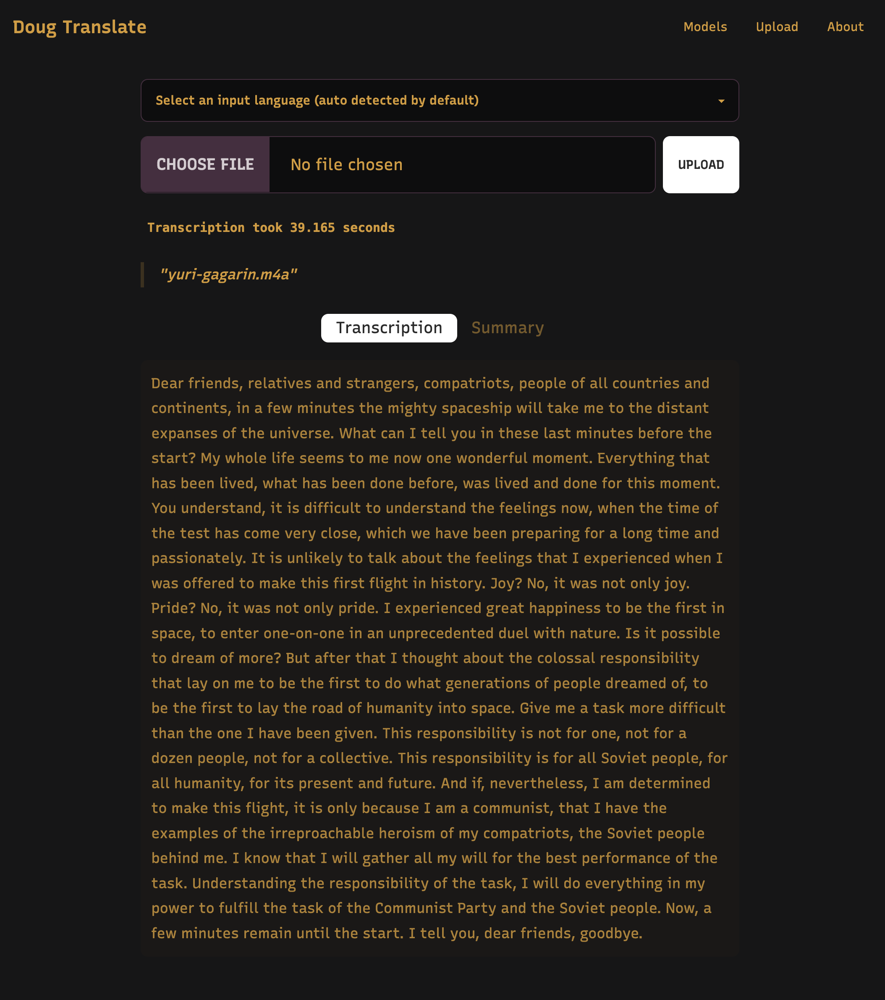

# doug-translate



## Dev

```bash
# set LEAPFROGAI_BASE_URL in .env first
npm ci
npm run dev --open
```

## Bulding the Zarf Packages

```bash
./hack/build.sh
```

## Running the Zarf Packages

```bash
./hack/deploy-amd64.sh <leapfrog ai url> <istio domain>
```
## Deploying on DUBBD (wip)

1. Deploy DUBBD
2. Edit values in `manifests` to match DUBBD istio config
3. Create `doug-translate`'s Zarf package and deploy it

```bash
docker build . -t defenseunicorns/doug-translate:0.0.1

zarf package create -o pkgs --confirm

# <url>, <model_name> and <domain> are optional
# defaults for these values are located in the zarf.yaml
zarf package deploy \
    pkgs/zarf-package-doug-translate-amd64-0.0.1.tar.zst \
    --set LEAPFROGAI_BASE_URL="<url>" \
    --set DOMAIN="<domain>" \
    --set SUMMARIZATION_MODEL="<model_name>" \
    -l=debug \
    --confirm
```
